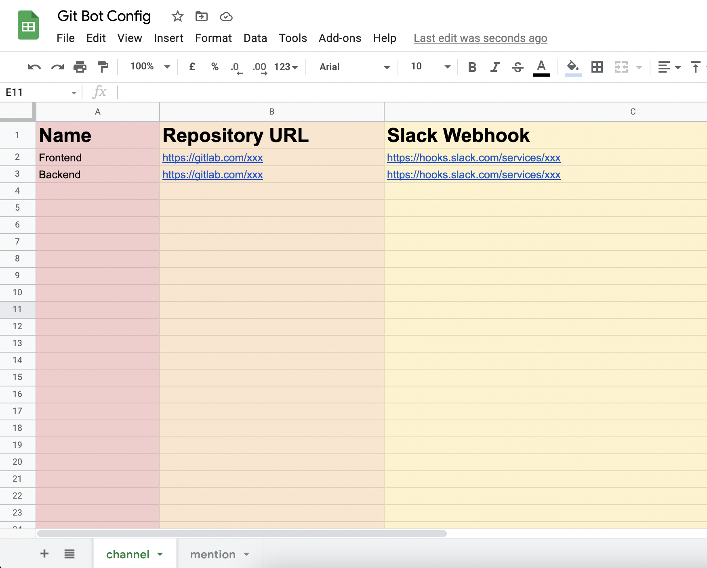
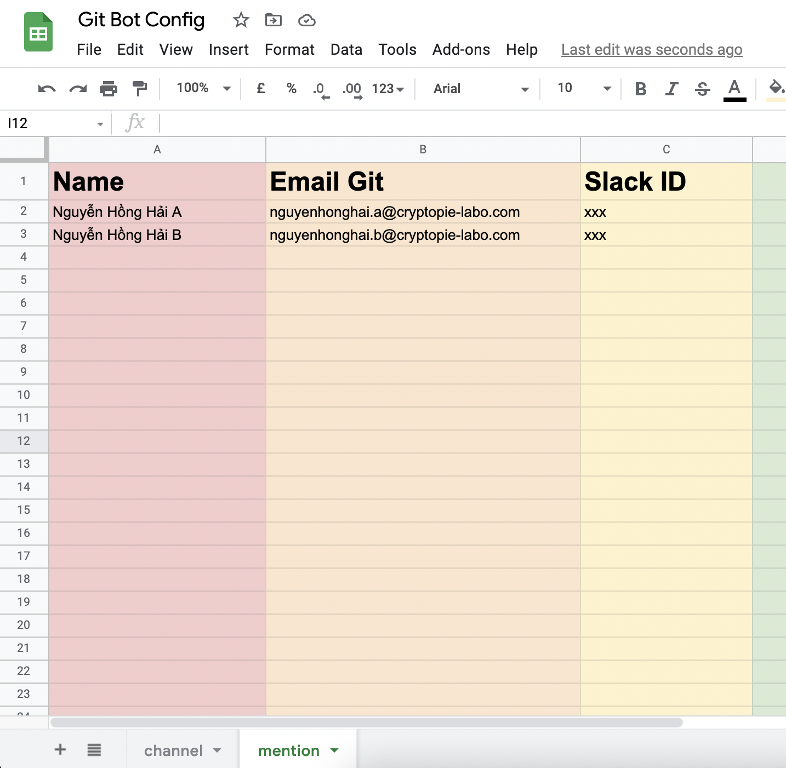

## Tạo google sheet có 2 sheet như ảnh bên dưới, chú ý tên sheet phải để giống trong ảnh



Làm theo hướng dẫn trong bài này để lấy GoogleSheetApi, chú ý đến đoạn code gs thì dùng code bên dưới
```
https://viblo.asia/p/huong-dan-tao-api-lay-du-lieu-tu-google-sheet-maGK70zxZj2
```

Script
```javascript
function doGet(e) {
    return handleResponse(e);
}

var SHEET_CHANNEL = "channel";
var SHEET_MENTION = "mention";

var SCRIPT_PROP = PropertiesService.getScriptProperties();

function handleResponse(e) {
    var lock = LockService.getPublicLock();
    lock.waitLock(30000);

    try {
        var doc = SpreadsheetApp.openById(SCRIPT_PROP.getProperty("key"));

        var sheet_channel = doc.getSheetByName(SHEET_CHANNEL);
        var channel_values = sheet_channel.getRange(2, 2, 500, 2).getValues();
        var channels = {};
        for (var row in channel_values) {
            if (channel_values[row][0] && channel_values[row][1]) {
                channels[channel_values[row][0]] = channel_values[row][1];
            }
        }

        var sheet_mention = doc.getSheetByName(SHEET_MENTION);
        var mention_values = sheet_mention.getRange(2, 2, 500, 2).getValues();
        var mentions = {};
        for (var row in mention_values) {
            if (mention_values[row][0] && mention_values[row][1]) {
                mentions[mention_values[row][0]] = mention_values[row][1];
            }
        }
      
        var content = {
            "channels": channels,
            "mentions": mentions
        };

        return ContentService
            .createTextOutput(JSON.stringify({"result": "success", "content": content}))
            .setMimeType(ContentService.MimeType.JSON);
    } catch (e) {
        return ContentService
            .createTextOutput(JSON.stringify({"result": "error", "error": e}))
            .setMimeType(ContentService.MimeType.JSON);
    } finally {
        lock.releaseLock();
    }
}

function setup() {
    var doc = SpreadsheetApp.getActiveSpreadsheet();
    SCRIPT_PROP.setProperty("key", doc.getId());
}
```